# 赛尔笔记|Text-to-SQL介绍

## 作者：窦隆绪、潘名扬、乔振浩

## 任务介绍

在本篇文章中，我们首先会对Text-to-SQL这个问题进行一个简单的介绍，然后尝试通过介绍数据集的发展脉络对这个问题进行进一步剖析解读，最后对主流模型按照时间线的顺序进行梳理整理。希望以此抛砖引玉，使读者对于Text-to-SQL有一个概括且全面的了解。

在现实生活中有许许多多的数据库，存储着各行各业的信息，比如学校的选课信息、成绩信息，公司的账务信息、人员流动。SQL是一种数据库查询语言，具有极大的灵活性和强大的功能，然而对于普通人来说，SQL学习门槛高，编写起来也很麻烦。即使对于计算机从业者来说，想要针对不同的数据库和应用场景，编写大量的并保证正确率的SQL语句，也着实需要下一番功夫。如果我们能够作出一个工具，自动的把我们的需求转化为SQL查询语句，再交给计算机去执行，使得所有人都能方便的进行查询，那就大大提高了我们的生活和工作效率。

Text-to-SQL就是这样一项转化自然语言描述为SQL查询语句的技术，以此来辅助人们进行数据库查询。举个例子：当我们询问智能助手 “贾樟柯导演是在哪出生的啊？” ，Text-to-SQL模型就会先根据问句解析出SQL语句“SELECT birth_city FROM director WHERE name  =  "贾樟柯"”，再对数据库执行该命令，最后向用户返回查询结果“山西省汾阳市”。

目前这个研究问题引起了学术界和工业界的广泛关注，有着很多的比赛和标注数据集，其中比较有名的，包括有关机票订阅的ATIS数据集、有关地理信息查询的GeoQuery、基于维基百科的WikiSQL以及目前最复杂的多领域数据集Spider。在中文Text-to-SQL任务方面，西湖大学日前公布了CSpider数据集，追一科技在天池数据平台举行了第一届中文text2sql挑战赛。

在这里，我们给出Text-to-SQL任务一个相对正式的定义：在给定关系型数据库（或表）的前提下，由用户的提问生成相应的SQL查询语句。并在下图给出一个现实的例子，问题为：有哪些系的教员平均工资高于总体平均值，请返回这些系的名字以及他们的平均工资值。可以看到该问题对应的SQL语句是很复杂的，并且有嵌套关系。

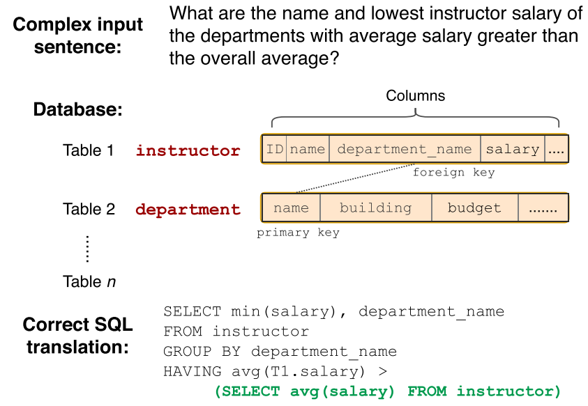

##  相关数据集介绍

#### 1.早期数据集：ATIS&GeoQuery

ATIS（Air Travel Information System），来源于机票订阅系统，是由用户提问生成SQL语句的单一领域、上下文相关的数据集。GeoQuery是880条对美国地理有关的提问与对应的SQL语句，单一领域、上下文无关的数据集。

#### 2.WikiSQL

ATIS&GeoQuery这两个数据集存在着数据规模小（SQL不足千句），标注简单等问题。于是，2017年，Victor Zhong等研究人员基于维基百科，标注了80654的训练数据，涵盖了26521个数据库，取名为WikiSQL。这个大型数据集的推出引起学界的广泛关注，它对模型的设计提出了新的挑战，需要模型更好的建构Text和SQL之间的映射关系，更好的利用表格中的属性，更加关注解码的过程。于是激发出了一系列的优秀模型，其中的代表工作seq2sql、SQLNet、TypeSQL我们将在‘主流工作’一章进行详细的介绍。

项目链接：https://github.com/salesforce/WikiSQL

#### 3.Spider

但是WikiSQL也存在着一个问题，它的标注只针对一个领域，而且每个问题只涉及一个表格，这个不是很符合我们日常生活中的场景。生活中存在着医疗、票务、学校、交通等各个领域的数据库，而且每个数据库又有数十甚至上百个表格，表格之间又有着复杂的主外键联系。

根据这种需要，耶鲁大学的研究人员推出了Spider数据集，这也是目前最复杂的Text-to-SQL数据集。它有以下几个特点：1）领域比较丰富，拥有来自138个领域的200多个数据库，每个领域平均对应5.1个表格，并且训练集、测试集中出现的数据库不重合。 2）SQL语句更为复杂，包含orderBy、union、except、groupBy、intersect、limit、having 关键字，以及嵌套查询等。作者根据SQL语句的复杂程度（关键字个数、嵌套程度）分为了4种难度，值得注意的是WikiSQL的难度在这个划分下只在EASY。Spider相比WikiSQL对模型的跨领域能力、生成复杂SQL的能力提出了新的要求，目前的最佳模型也只有60%左右的准确度。

挑战赛链接：https://yale-lily.github.io/spider

下面是Hard和Extra Hard的实例：

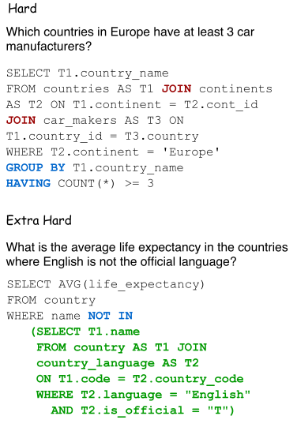

#### 4.中文CSpider

西湖大学在EMNLP2019上提出了一个中文text-to-sql的数据集，选择Spider作为源数据集进行翻译，得到了CSpider数据集，并利用SyntaxSQLNet作为基线系统进行了测试，同时探索了在中文上产生的一些额外的挑战，包括中文问题对英文数据库的对应问题(question-to-DB mapping)、中文的分词问题以及一些其他的语言现象。

挑战赛链接：https://taolusi.github.io/CSpider-explorer/

#### 5.Sparc

耶鲁大学的研究团队后续又推出了SParC，即Spider的上下文相关版本。数据库基于Spider，模拟了用户进行数据库查询的过程：用户通过若干条相关的提问最后达到一个最终查询目的。

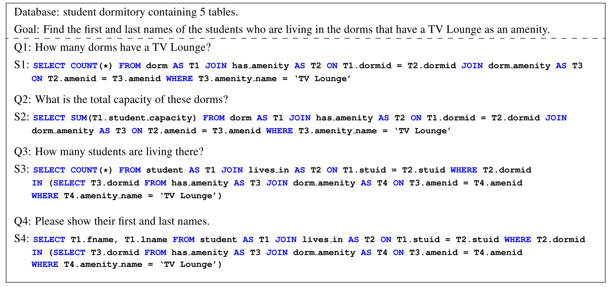

挑战赛链接：https://yale-lily.github.io/sparc

不同数据集对比如下图所示（平均含表格指每个数据库平均包含多少个表格）

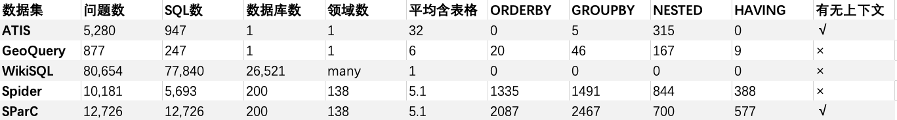

## 评价方法

Text-to-SQL的评价方法主要包含两种，一个是精确匹配率（exact match ），另一个是执行正确率（execution accuracy）。精确匹配指预测得到的SQL与正确的SQL语句在SELECT、WHERE等模块完全达到字符串匹配，即整句匹配；执行正确是指，执行预测得到的SQL语句，数据库能够返回答案。目前WikiSQL支持exact match和execution accuracy，Spider只支持exact match。

## 模型介绍

在深度学习的研究背景下，很多研究人员将Text-to-SQL看做一个序列到序列的生成任务，在seq2seq的模型框架提高自己的模型。基线模型seq2seq在加入Attention、Copying等机制后，能够在ATIS、GeoQuery数据集上达到84%的精确匹配，但是在WikiSQL上只能达到23.3%的精确匹配，37.0%的执行正确率；在Spider上则只能达到5～6%的精确匹配。

究其原因，可以从编码和解码两个角度来看。首先编码方面，自然语言问句与数据库之间需要形成很好的对齐或映射关系，即问题中到底涉及了哪些表格中的哪些实体词，以及问句中的词语触发了哪些选择条件、聚类操作等；另一方面在解码部分，SQL作为一种形式定义的程序语言，本身对语法的要求更严格（关键字顺序固定）以及语义的界限更清晰，失之毫厘差之千里。普通的seq2seq框架并不具备建模这些信息的能力。

于是，主流模型的改进与后续工作主要围绕着以下几个方面展开：通过更强的表示（BERT、XLNet）、建模数据库和问题间的结构信息（GNN）、来显示地加强Encoder端的对齐关系；通过树形结构解码、填槽类解码以及解码后的重排序来减小搜索解空间，以增加SQL语句的正确性；通过数据增强、中间表示等技术提高SQL语言的抽象性，以数据表现结构的角度使模型更容易学到句子、数据库、SQL三者之间的对齐关系；通过定义新的对齐特征，利用重排序技术，对beam search得到的多条候选结果进行正确答案的挑选。

#### 1.Pointer Network

传统的seq2seq模型的解码器部分所使用的单词表是固定的，即在生成序列中都是从固定的单词表中进行选取。但Text-to-SQL不同于一般的seq2seq任务，它的生成序列中可能出现：a）问句中的单词; b) SQL关键字; c)对应数据库中的表名、列名。

Pointer Network很好地解决了这一问题，其输出所用到的词表是随输入而变化的。具体做法是利用注意力机制，直接从输入序列中选取单词作为输出。

在Text-to-SQL任务中，可以考虑把用户的提问以及目标SQL语句可能出现的其他词作为输入序列 (列名单词序列；SQL的关键字表；问题的单词序列)，利用Pointer Network直接从输入序列中选取单词作为输出。在解码器的每一步，与编码器的每一个隐层状态计算注意力分数，取最大值作为当前的输出以及下一步的输入。

#### 2.Seq2SQL

Pointer Network虽然一定程度上解决了问题，但是它并没有利用到SQL语句固有的语法结构。Seq2SQL将生成的SQL语句分为三个部分： 聚合操作：（SUM、COUNT、MIN、MAX等）、SELECT：选取列、WHERE：查询条件。每一部分使用不同的方法进行计算。

SELECT与聚合操作，均采用了注意力机制进行分类。WHERE子句可以利用前面介绍的Pointer Network进行训练，但是对于很多查询来说，WHERE子句的写法并不是唯一的，例如：

SELECT name FROM insurance WHERE age > 18 AND gender = "male";

SELECT name FROM insurance WHERE gender = "male" AND age > 18;

这可能导致原本正确的输出被判断为错误的。于是作者提出利用强化学习基于查询结果来进行优化。在解码器部分，对可能的输出进行采样，产生若干个SQL语句，每一句表示为y=[y1,y2...yT]，用打分函数对每一句进行打分：

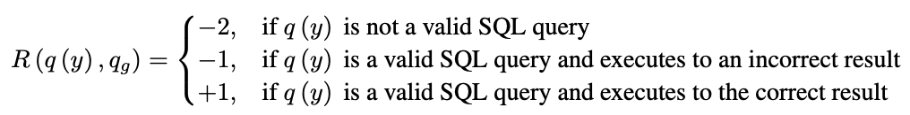

#### 3.SQLNet

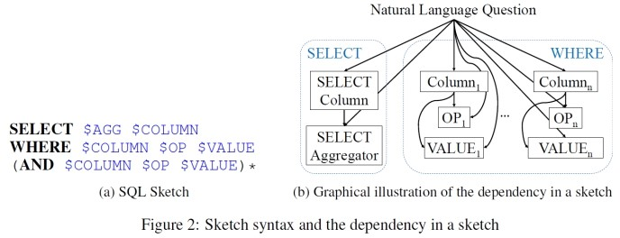

为了解决Seq2SQL使用强化学习效果不明显的问题，SQLNet将SQL语句分成了SELECT和WHERE两个部分，每个部分设置了几个槽位，只需向槽位中填入相应的符号即可。  

SELECT子句部分与Seq2SQL类似，不同地方在于WHERE子句，它使用了一种sequence-to-set（由序列生成集合）机制，用于选取目标SQL语句中的WHERE子句可能出现的列。对于表中的每一列给出一个概率。之后计算出WHERE子句中的条件个数k，然后选取概率最高的前k个列。最后通过注意力机制进行分类得到操作符和条件值。

 

#### 4.TypeSQL

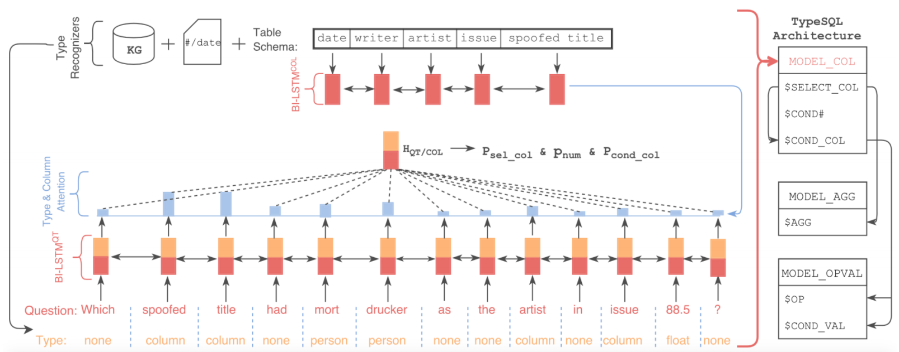

该模型基于SQLNet，使用模版填充的方法生成SQL语句。为了更好地建模文本中出现的罕见实体和数字，TypeSQL显式地赋予每个单词类型。

类型识别过程：将问句分割n-gram （n取2到6），并搜索数据库表、列。对于匹配成功的部分赋值column类型赋予数字、日期四种类型：INTEGER、FLOAT、DATE、YEAR。对于命名实体，通过搜索FREEBASE，确定5种类型：PERSON，PLACE，COUNTREY，ORGANIZATION，SPORT。这五种类型包括了大部分实体类型。当可以访问数据库内容时，进一步将匹配到的实体标记为具体列名（而不只是column类型）

SQLNet为模版中的每一种成分设定了单独的模型；TypeSQL对此进行了改进，对于相似的成分，例如$SELECT_COL 和$COND_COL以及#COND（条件数），这些信息间有依赖关系，通过合并为了单一模型，可以更好建模。TypeSQL使用3个独立模型来预测模版填充值：

MODEL_COL：$SELECT_COL，$COND#，$COND_COL

MODEL_AGG：$AGG

MODEL_OPVAL：$OP, $COND_VAL

#### 5.SyntaxSQLNet

相比于之前decoder输出一段线性的文本，SyntaxSQLNet将解码的过程引入了结构性信息，即解码的对象为SQL语句构成的树结构。（准确率+14.8%）

SyntaxSQLNet将SQL语句的预测分解为9个模块，每个模块对应了SQL语句中的一种成分。解码时由预定义的SQL文法确定这9个模块的调用顺序，从而引入结构信息。树的生成顺序为深度优先。分解出的9个模块有：

IUEN模块：预测INTERCEPT、UNION、EXCEPT、NONE（嵌套查询相关）

KW模块：预测WHERE、GROUP BY、ORDER BY、SELECT关键字

COL模块：预测列名

OP模块：预测>、<、=、LIKE等运算符

AGG模块：预测MAX、MIN、SUM等聚合函数

Root/Terminal模块：预测子查询或终结符

Module模块：预测子查询或终结符

AND/OR模块：预测条件表达式间的关系

DESC/ASC/LIMIT模块：预测与ORDER BY相关联的关键字

HAVING模块：预测与GROUP BY相关的Having从句

 

该工作同时提供了一种针对text2sql任务的数据增强方法，生成跨领域、更多样的训练数据。（准确率++7.5%）

具体做法为：对SPIDER中的每条数据，将值和列名信息除去，得到一个模版； 对处理后的SQL模版进行聚类，通过规则去除比较简单的模版，并依据模板出现的频率，挑选50个复杂SQL模板； 人工核对SQL-问句对，确保SQL模板中每个槽在问句中都有对应类型的信息。

得到一一对应的模板后，应用于WikiSQL数据库：首先随机挑选10个模板，然后从库中选择相同类型的列，最后用列名和值填充SQL模板和问句模板。通过该方法，作者最终在18000的WikiSQL数据库上得到了新的98000组训练数据，同时在训练的时候也利用了WikiSQL数据集原有的训练数据。

#### 6.IRNet

与SyntaxSQLNet类似，IRNet定义了一系列的CFG文法，将SQL转发为语法树结构。可以将其看作一种自然语言与SQL语句间的中间表示（作者称之为SemQL），整个parsing的过程也是针对SemQL进行的。如下：

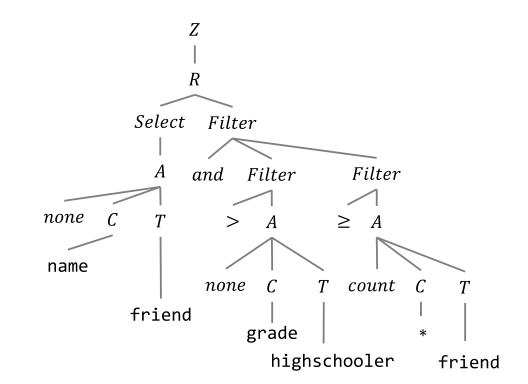

作者另一部分的改进主要在scheme linking，即如何找到问题中所提到的表格与列。他将问题中可能出现的实体分为3类：表格名、列名、表中的值。根据3类实体的不同，具体做法分为：a）表格名和列名：以n-gram的形式枚举问题中的span，然后和表格名、列名进行匹配。可以看到下图中的Question中对应的单词有的被标成了Column或者Table。 b) 表中的值：将问题中以引号为开头结尾的span，送给conceptnet进行查询，再将返回结果中的 ‘is a type of’/'related terms'关系的词与列名进行匹配。

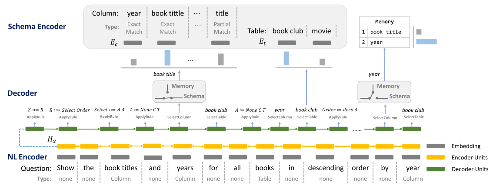

#### 7.Global-GNN

为了更好的利用关系型数据库的结构信息，Ben Bogin等研究人员提出使用图网络来建模表格名和列名。如下图所示：圆圈加粗的结点代表表格，不加粗的结点代表列名；双向边代表表格和列名的从属关系；红虚边和蓝虚边代表主外键关系。橙色节点代表与问题有关的结果，淡色为无关。

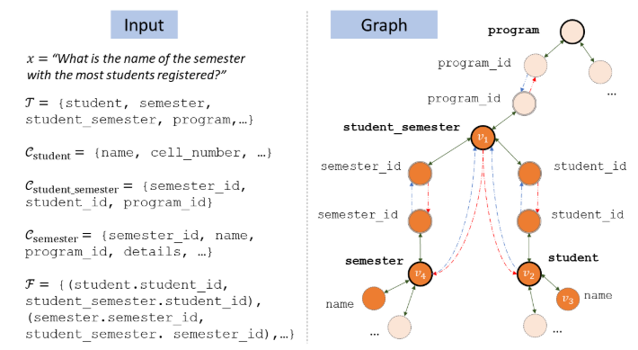

除此之外，该团队还提出了一种基于全局信息重排序的做法。首先先看下面这个例子，我们不知道name到底指向的是singer还是song，但是我们可以观察到nation只在singer中出现，所以应该是singer.name。这样做global reasoning，就能减小歧义性。

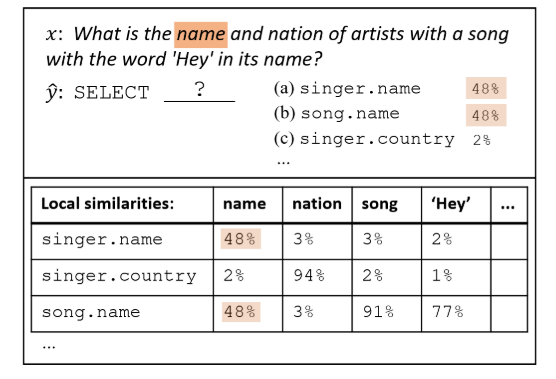

整个工作的流程如下图所示：

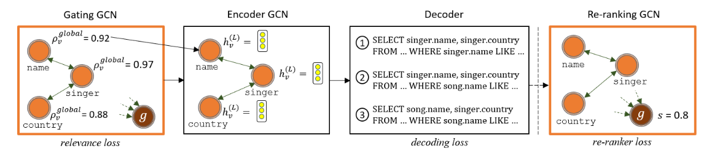 

#### 8.RAT-SQL

该工作可以看做图网络GNN的后续工作，作者在Table、Column、Quetion三者之间定义了更多的边（共33种），是目前榜单上的最强模型。

### 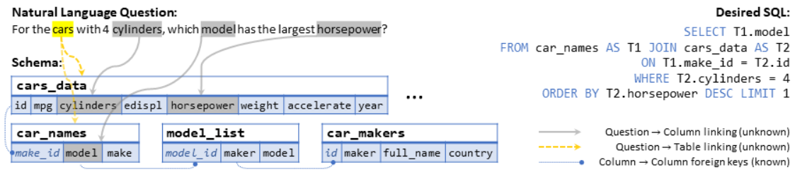

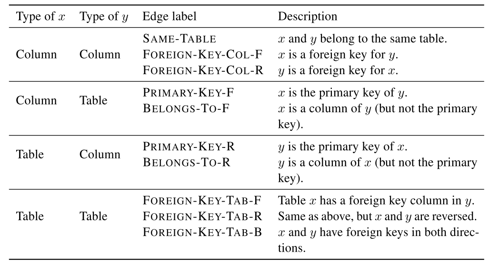

## 总结

目前，SQL生成任务因其实用的应用场景，引起了学术界和工业界的广泛关注。目前大家的做法也是百花齐放：中间表示、树形解码、图网络建模Quetion和数据库间的关系、重排序、数据增强。但目前的模型，还不能很好解决复杂的操作，例如IRNet在Hard和Extra Hard的准确率也仅为48.1%和25.3%。期待后面能有更加有效、简洁、优雅的工作出现。

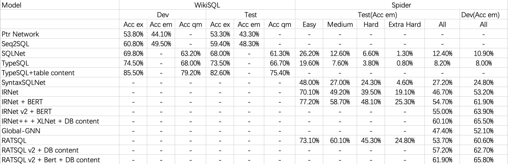

注：
Acc ex: 执行结果
Acc em: SQL完全匹配
Acc qu: SQL无序匹配

### 相关引用：

1. Seq2sql: Generating structured queries from natural language using reinforcement learning

2. Towards Complex Text-to-SQL in Cross-Domain Database with Intermediate Representation

3. SParC: Cross-Domain Semantic Parsing in Context

4. CoSQL: A Conversational Text-to-SQL Challenge Towards Cross-Domain Natural Language Interfaces to Databases

5. Pointer Networks

6. Neural semantic parsing with type constraints for semi-structured tables

7. SQLNet: Generating Structured Queries From Natural Language Without Reinforcement Learning

8. TypeSQL: Knowledge-based Type-Aware Neural Text-to-SQL Generation

9. SyntaxSQLNet: Syntax Tree Networks for Complex and Cross-DomainText-to-SQL Task

10. Editing-Based SQL Query Generation for Cross-Domain Context-Dependent Questions

11. Towards Complex Text-to-SQL in Cross-Domain Database with Intermediate Representation

12. Global Reasoning over Database Structures for Text-to-SQL Parsing

13. RAT-SQL: Relation-Aware Schema Encoding and Linking for Text-to-SQL Parsers

14. Learning to Map Context-Dependent Sentences to Executable Formal Queries
15. Coarse-to-Fine Decoding for Neural Semantic Parsing
16. A Pilot Study for Chinese SQL Semantic Parsing

 

 

 

 

 